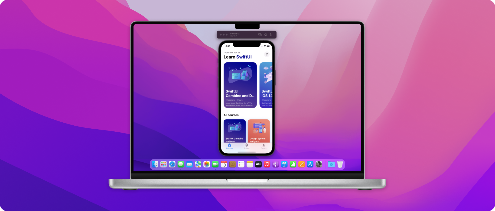

    

This application deals with **asynchronous functions**. The best way to learn about async and await is to make network calls.

The **Home View** is a view loaded with data. You'll learn how to make use of Contentful, a Content Management System, to host our data on the cloud. Using [Apollo GraphQL](https://www.apollographql.com), you'll fetch that data from [Contentful](https://www.contentful.com), and process it in our application in order to display the data in beautiful cards. All of this network call will be done using **async/await** and **continuation**.

You'll also learn how to implement new features that were added to `SwiftUI 3.0`: date formatter, pull down to refresh, swipe actions, search and AttributedString. Moreover, we'll make our app more accessible by enabling localization for our content, and adding labels and values to make our views more accessible for VoiceOver users.

This app will mostly focus on logic, backend and functions. We won't cover a lot of UI.

## Requirements

This app was built with **Xcode 13**, **iOS 15** and **MacOS Monterey**. It's important that you meet these requirements, as some newly introduced features are only available after iOS 15 and in Xcode 13.

    

## Contentful

**Contentful** is a content management system, or CMS. It's a tool that lets us manage our content and collaborate with other members of our team. Each iteration of our content is also saved, so we can go back in time to retrieve an older version. It's also super easy to integrate Contentful in our applications, as Contentful can be integrated with many platforms and languages. You can take a look at their [detailed documentation here](https://www.contentful.com/developers/docs/).

In this app, we'll be using [Apollo GraphQL](https://www.apollographql.com) along with Contentful, because GraphQL queries are easy to deal with and we can fetch more precise data this way. If we were to use the [Contentful iOS Delivery API](https://github.com/contentful/contentful.swift/), the queries are less precise and performance is less optimized than with Apollo GraphQL.

## Apollo GraphQL

**Apollo GraphQL** is a modern framework that uses [GraphQL](https://graphql.org) - a query language - to make API calls to a cloud server. It's used by many big companies to build, manage, and access data. It's also open source, meaning that it's free.

In our case, we'll fetch data from Contentful using Apollo GraphQL. This way, we'll only fetch the data we really need, and Apollo will deal with asynchronous fetching for us, to make our app more performant. Apollo is also so much more than just a tool to query data. You can learn more about all the features in the platform by visiting [this page on their website](https://www.apollographql.com/platform/).

